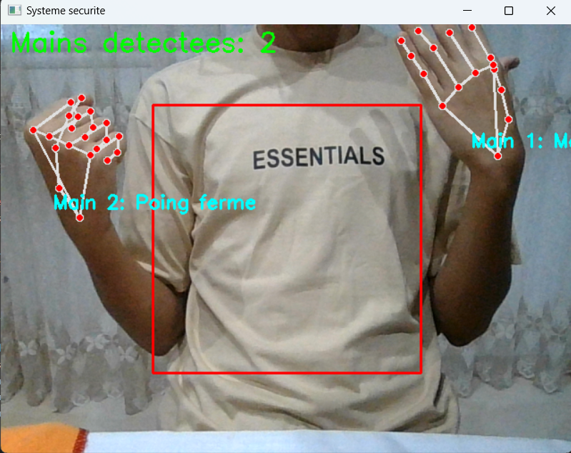
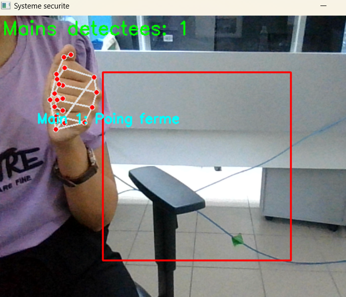
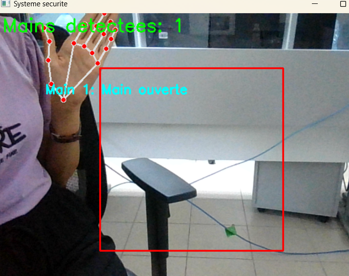

\# Vision-Based Safety System using Raspberry Pi and MediaPipe


This project detects hands in a restricted zone using a webcam, OpenCV, and MediaPipe. If a hand enters the red zone, the system activates an LED and logs the event in a CSV file.


\##  Features


\- Real-time hand detection and tracking with MediaPipe

\- Gesture recognition (open hand vs. closed fist)

\- Danger zone detection using a red rectangle on screen

\- Activates an LED using Raspberry Pi GPIO if danger is detected

\- Saves gesture data and timestamps in `DATA\_BASE.csv`


\##  Requirements


\- Raspberry Pi (any model with GPIO)

\- Python 3

\- Webcam connected to the Raspberry Pi


\### Python Libraries:

```bash

pip install opencv-python mediapipe RPi.GPIO


\*\*\*\*\*\*\*\*\*\*\*\*Run the System

After connecting your LED to GPIO 23:


&nbsp;   python3 sur\_ras.py


Press ESC key to stop the program.


\*\*\*\*\*\*\*\*\*\*\*\*Project Structure

&nbsp;mediapipe-safety-system\_project/

├── sur\_ras.py          # Main Python script

├── README.md           # Project documentation

├── screenshot1.png

├── screenshot2.png

├── screenshot3.png

├── hand_detected.png


└── DATA\_BASE.csv       # Log file created at runtime


## 📸 Screenshots

### 🔴 Hand Detected in Danger Zone


### 🟢 Normal Operation



